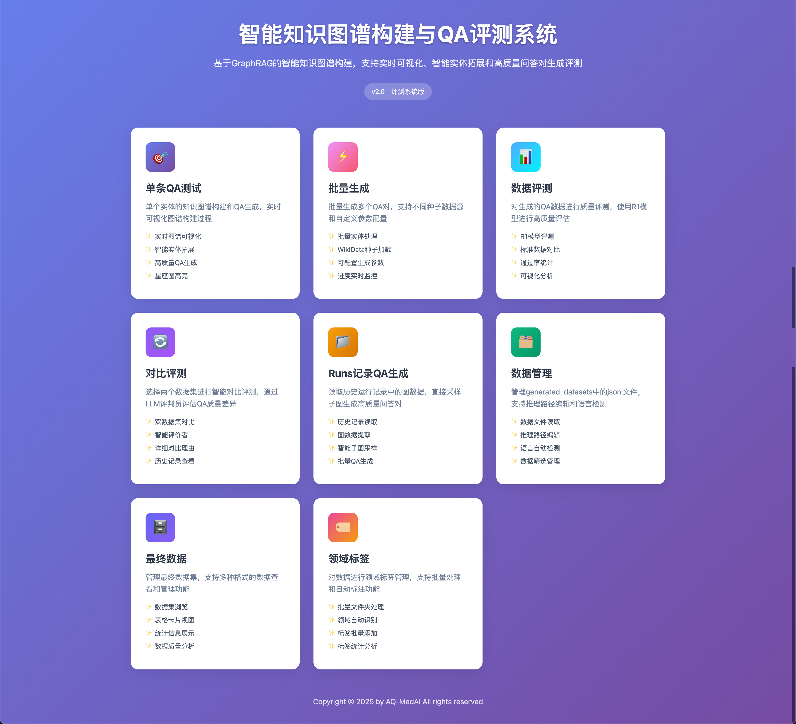
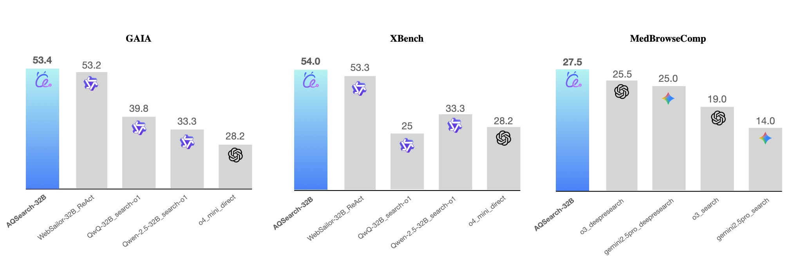

# MedResearcher-R1: Knowledge-Informed Trajectory Synthesis Approach

<div align="center">
  
</div>

<p align="center">
｜🤗 <a href="https://huggingface.co/AQ-MedAI/MedResearcher-R1-32B" target="_blank">HuggingFace 模型</a> ｜
📄 <a href="https://arxiv.org/abs/2508.14880" target="_blank">arXiv</a> ｜
🌐 <a href="README.md">English</a> ｜
</p>


<!-- <p align="center">
  <a href="#">
    
  </a>
  <a href="#">
    
  </a>
</p> -->


**MedResearcher-R1** 是一个综合性的**训练数据生成与合成框架**，通过**知识引导的轨迹合成**技术解决领域特定AI推理的挑战。我们的框架提供端到端的高质量训练数据生成解决方案，由三个集成组件组成：

**🧠 知识图谱构建**：我们的核心创新 - 智能知识图谱构建与问答合成系统，将领域知识转化为高质量的问答对，并自动生成推理路径。该模块是创建领域特定训练数据的基础。



**🔄 轨迹生成管道**：端到端轨迹合成与优化系统，将问答对转换为多轮推理轨迹，包含工具交互和质量过滤，用于模型训练。

**📊 评估管道**：综合模型评估与验证框架，用于评估多个基准测试中的推理性能，并验证合成训练数据的质量。

这三个组件构成了一个完整的**训练数据生产管道**，从知识提取到模型训练数据生成和评估，使得能够为领域特定应用创建专门的推理模型。


## 功能特性
- **知识图谱构建**
  - **界面支持**：基于D3.js力导向图的交互式Web可视化
  - **高级采样算法**：5种复杂子图提取策略（mixed、augmented_chain、community_core_path、dual_core_bridge、max_chain）
  - **统一问答生成**：深度概念混淆，结合定量推理和多范式问题合成
  - **推理路径生成**：自动化作弊表创建，为复杂多跳问题提供详细的逐步推理指导
  - **批处理系统**：并发问答生成，智能QPS控制、进度监控和恢复能力

- **轨迹生成管道**
  - **智能体框架**：多轮推理，集成工具和并发任务处理
  - **高级质量过滤**：基于Token的验证、工具调用/响应匹配和自动错误检测
  - **智能重写系统**：基于LLM的轨迹优化，使用掩码轨迹引导（MTG）

- **评估管道**
  - **交互式问题推理**：单问题模式，详细的逐步过程可视化
  - **批量数据集评估**：多工作进程并行处理，可配置的rollouts和超时控制

## 性能亮点

基于我们的知识引导轨迹合成框架，我们开发了**MedResearcher-R1**，这是一个专门的推理模型，在多个基准测试（MedBrowseComp、GAIA和XBench-DeepSearch）中表现出色。



## 开源数据集

我们开源了通过KnowledgeGraphConstruction模块构建的高质量问答数据集。该数据集位于 [`TrajectoryGenerationPipeline/qa_data/open_data.jsonl`](TrajectoryGenerationPipeline/qa_data/open_data.jsonl)，包含：

- **复杂推理问答对**：使用我们的图方法生成的多跳问题
- **详细的逐步推理路径**：为每个问题提供全面的问题解决指导

## 新闻

- [2025.8] 🎉 我们用于生成问答和轨迹训练的框架正式发布！

## 链接

- [功能特性](#功能特性)
- [性能亮点](#性能亮点)
- [开源数据集](#开源数据集)
- [安装](#安装)
- [快速开始](#快速开始)
- [演示视频](#演示视频)
- [引用](#引用)

## 安装

### MedResearcher-R1 环境

> **注意：此项目需要Python版本 >= 3.10。请确保您的环境满足此要求。**

#### 使用 venv
```bash
# 创建 venv
python -m venv .venv
source .venv/bin/activate
# 安装依赖
pip install -r requirements.txt
```

#### 使用 conda
```bash
# 创建指定Python版本的conda环境
conda create -n med_researcher python=3.10

# 激活环境
conda activate med_researcher

# 安装依赖
pip install -r requirements.txt
```

## 快速开始

使用知识引导轨迹合成训练领域特定推理智能体。

(1) 设置环境
```bash
set -a
# 在示例中填写您的环境变量
source env.example
set +a

```

(2) (可选) 运行图形Web服务器，使用我们的前端界面了解如何生成问答并评估/过滤生成问答的质量
```bash
python KnowledgeGraphConstruction/start_web.py
```

然后您可以在 http://localhost:5000 使用前端界面。您可以从单个问答测试页面开始，在运行批处理操作之前了解生成过程。

📖 **详细功能描述请参考**：[features-guide.md](./features-guide.md)

(3) 使用脚本批量生成或使用我们提供的数据集
```bash
cd KnowledgeGraphConstruction
# 运行批量生成 - 更高的max-iterations将生成更复杂的问答对
python batch_qa_cli.py --seed-file demo_medical.csv --output ../TrajectoryGenerationPipeline/dataset/qa.jsonl --max-iterations 1

# 或者，您可以使用我们提供的开源数据集
# cp ../TrajectoryGenerationPipeline/qa_data/open_data.jsonl ../TrajectoryGenerationPipeline/dataset/qa.jsonl
```

(4) 启动轨迹生成和后处理管道。

配置轨迹生成模块：

首先，使用您的模型设置更新 `TrajectoryGenerationPipeline/src/trajectory_generation/config.json`。您需要至少修改以下配置参数：

- `llm_config.api_key_env`：您的API密钥的环境变量名（您仍需要设置实际的环境变量）。示例：`API_KEY`
- `llm_config.api_base`：您的模型提供商的API URL
- `generation.model`：模型名称。对于OpenRouter，您可以在 https://openrouter.ai/models 查看可用的模型名称
- `generation.dataset`：`TrajectoryGenerationPipeline/qa_data` 目录中的数据集文件（仅接受JSONL格式）。您可以使用我们提供的 `open_data.jsonl` 或生成自己的数据集

**重要**：读取工具需要OpenRouter API密钥。请：
- 设置您的 `OPENROUTER_API_KEY` 环境变量，或
- 修改 `tools/tool_visit.py`（约第73行）中的LLM客户端以使用您首选的API。

```bash
cd ../TrajectoryGenerationPipeline

python src/trajectory_generation/run_reasoning.py
python src/postprocessing/pipeline.py --input_dir generation/your_model_name/your_dataset 
--mode eval_filter
python src/postprocessing/pipeline.py --input_dir generation/your_model_name/your_dataset 
--mode rewrite
```

(5) 使用生成的 rewritten_results.jsonl 进行训练

(6) 完成模型训练后，您可以通过vllm或sglang为模型创建服务器
```bash
pip install sglang[all]
CUDA_VISIBLE_DEVICES=0,1 python -m sglang.launch_server --model-path /path/to/your/model --port 6001 --host 0.0.0.0 --mem-fraction-static 0.95 --tp-size 2
```

(7) 使用评估模块评估模型性能

首先在 EvaluationPipeline/evaluation_config.json 中配置API密钥：
- llm.api_base：您的模型的API基础URL
- llm.model：指定您的模型名称（可选）
- llm.api_key_env：您的API密钥的环境变量名（可选）
```bash
cd ../EvaluationPipeline
# 运行单问题评估
python eval_cli.py --mode interactive

# 运行批量数据集评估
python eval_cli.py --mode batch --dataset sample --workers 20
```

## MedResearcher-R1 演示视频

<div align="center">
    <h3>xbench_demo</h3>
    <video src="assets/xbench_demo.mp4" />
</div>
## 引用

```bibtex
@article{medresearcher2025,
  title={MedResearcher-R1: Expert-Level Medical Deep Researcher via A Knowledge-Informed Trajectory Synthesis Framework},
  author={\author{Ailing Yu, Lan Yao, Jingnan Liu, Zhe Chen, Jiajun Yin, Yuan Wang, Xinhao Liao,Zhiling Ye,Ji Li,Yun Yue,Hansong Xiao,Hualei Zhou,Chunxiao Guo,Peng Wei,Jinjie Gu},
  journal={arXiv preprint arXiv:https://arxiv.org/pdf/2508.14880},
  year={2025}
}
```
